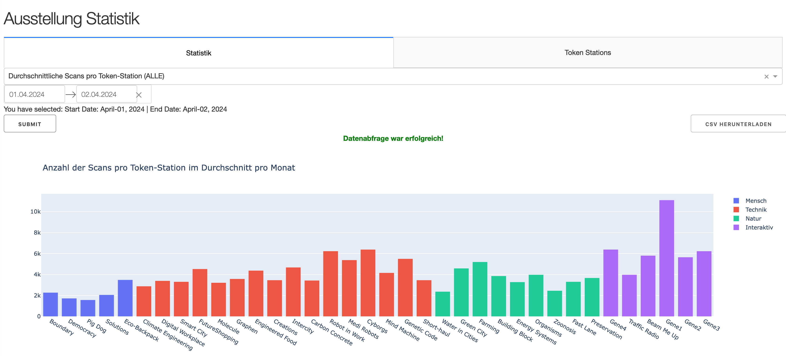
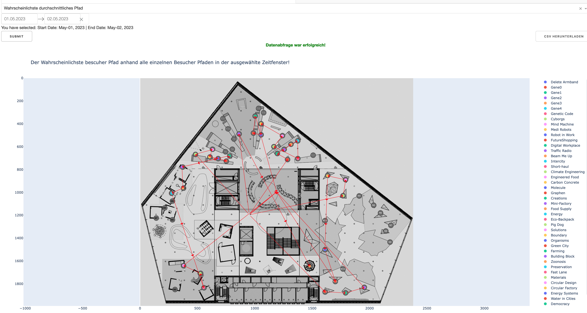
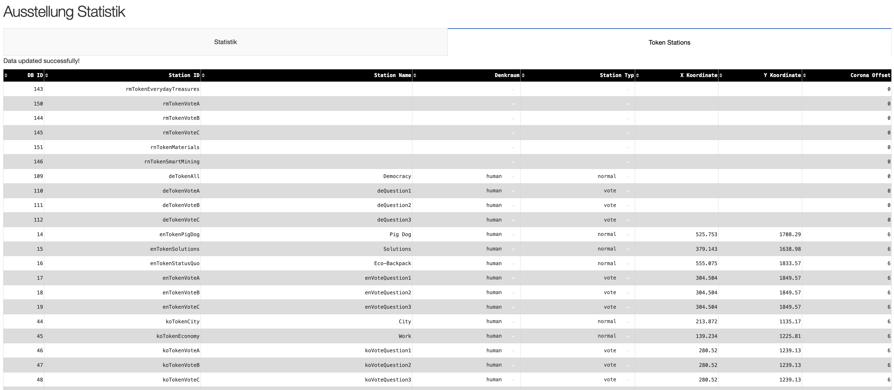

# Futurium Exhibition Statistic

This project provides statistical analysis and data visualization for the exhibition held at the Futurium museum in Berlin. It includes backend services for data storage and processing and a web application to display the statistics.

## Architecture

The project is divided into several components:

1. **Backend**:
   - **Python Backend**: 
        - The backend is built using Python and handles data capturing, pre-processing and storing. It subscribes to MQTT topics to gather interactions of visitors that are using their RFID bracelets on different exhibits.
        - The visitor interactions with the exhibition are stored in a MySQL DB with which the backend program interacts for storing and retrieving data.
        - Many intensive statistical calculations are done by the database when it is "cheaper" to do so.
   - **Redis**: Used as a message broker for background task processing.
   - **Celery**: Manages asynchronous tasks and schedules periodic jobs for data updates.
   - **Containerization**: The backend services are containerized using Docker. The `docker-compose` file defines the following services:
     - `web`: The main application service running the Flask application.
     - `redis`: The Redis service used by Celery for task queue management.
     - `worker`: The Celery worker service for handling asynchronous tasks.
     - `mysql-db`: The MySQL DB server
     - `phpmyadmin`: The PHP My Admin Web app for DB management.

2. **Web Application**:
   - **Flask**: Serves the main web application and API endpoints.
   - **Dash & Plotly**: Integrate with Flask to provide interactive data visualizations.
   - **Containerization**: 
        - The Flask application is also containerized as part of the `web` service in the `docker-compose` file.
        - `flask_dash_app`: The Flask/Dash app is also containerized in its own service.

3. **General**:
   - **Docker Compose**: The system is orchestrated using Docker Compose, managing dependencies and networking between the various services.
   - **Configuration System**: The application uses a centralized configuration system with environment variables and configuration files.

## Features

- Automatic Data ingestion and preprocessing to/from the DB.
- Asynchronous task processing using Celery and Redis.
- Interactive dashboards and visualizations using Flask, Dash & Plotly.
- RESTful API for accessing exhibition statistics.
- Simple table interface for users to interact with foundamental DB Entities.

## Tech Stack & Responsibilities

- Python (Flask, pandas, NumPy), MySQL, Redis, Celery
- Dash & Plotly for interactive dashboards and data visualization
- MQTT for ingesting time-series interaction events from RFID devices
- Docker & Docker Compose for multi-service orchestration

This project was designed and implemented end-to-end by me, including data modelling, backend services, ETL logic, and dashboard design.

## Screenshots

- 
- 
- 
